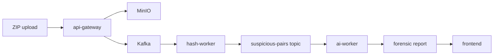
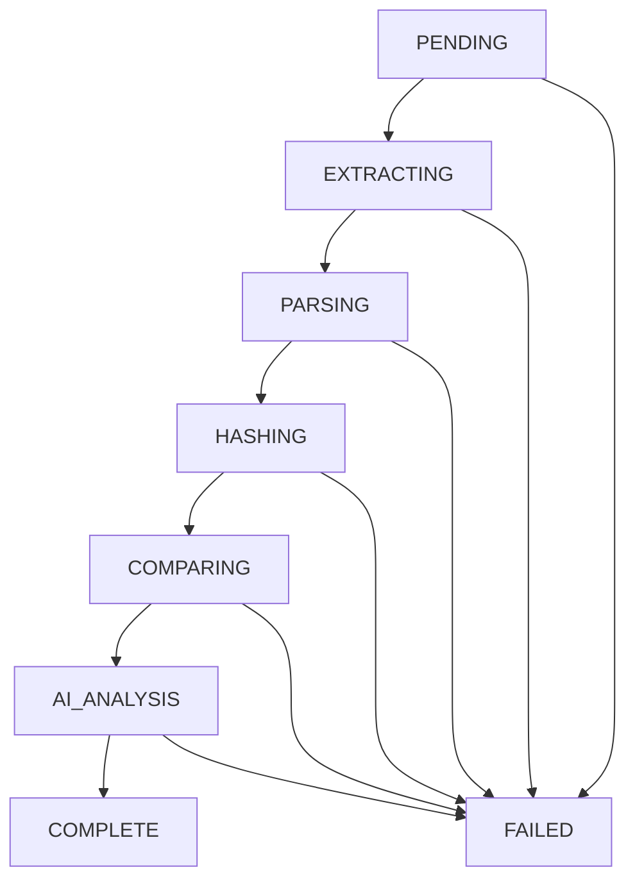

# Nexus

Distributed plagiarism detection system for C++ code submissions.

[Python 3.11] | [Node 20] | [TypeScript] | [Kafka] | [MinIO] | [Redis] | [License: MIT]

## How it works

Nexus is a distributed plagiarism detection system that receives ZIP archives of C++ files, parses them into AST token sequences to compute MinHash fingerprints, pre-filters similarities with LSH, and verifies exact Jaccard scores. The most suspicious code pairs are then routed to an LLM for forensic obfuscation analysis before the final report is surfaced to the frontend.



```text
ZIP upload → api-gateway → MinIO → Kafka → hash-worker → suspicious-pairs topic → ai-worker → forensic report → frontend
```

## Prerequisites

- git: `git --version`
- node >= 20: `node --version`
- pnpm >= 9: `pnpm --version`
- python 3.11: `python3.11 --version`
- docker: `docker --version`
- docker compose v2: `docker compose version`

## Quick start

1. Clone the repo
```bash
git clone <repo-url>
```
2. `cp .env.example .env` and fill in OPENAI_API_KEY
```bash
cp .env.example .env
```
3. `docker compose up -d`
```bash
docker compose up -d
```
4. Verify all services healthy: `docker compose ps`
```bash
docker compose ps
```
5. `pnpm install`
```bash
pnpm install
```
6. `cd services/hash-worker && pip install -e ".[dev]"`
```bash
cd services/hash-worker && pip install -e ".[dev]"
```
7. `cd services/ai-worker && pip install -e ".[dev]"`
```bash
cd services/ai-worker && pip install -e ".[dev]"
```
8. Start the api-gateway: `pnpm dev`
```bash
pnpm dev
```
9. Open http://localhost:3000

## Environment variables

| Variable | Required | Default | Description |
|---|---|---|---|
| KAFKA_BROKER | Yes | kafka:9092 | Kafka broker address |
| MINIO_ENDPOINT | Yes | minio:9000 | MinIO server address |
| MINIO_ROOT_USER | Yes | nexus | MinIO access key |
| MINIO_ROOT_PASSWORD | Yes | nexus-secret-change-in-prod | MinIO secret key |
| REDIS_URL | Yes | redis://localhost:6379 | Redis connection string |
| OPENAI_API_KEY | Yes | None | OpenAI API key for AI analysis |
| LLM_MAX_CONCURRENT | No | 5 | Max concurrent LLM requests |
| SUSPICIOUS_PAIR_THRESHOLD | No | 0.6 | Exact Jaccard similarity threshold |
| LSH_THRESHOLD | No | 0.5 | LSH pre-filter similarity threshold |
| LSH_NUM_PERM | No | 128 | Number of MinHash permutations |
| MAX_FILE_BYTES | No | 500000 | Maximum bytes per file to process |

## Project structure

```text
nexus/
├── apps/web/              # Next.js frontend
├── services/
│   ├── api-gateway/       # GraphQL API, Kafka producer, MinIO upload
│   ├── hash-worker/       # AST extraction, fingerprinting, LSH comparison
│   └── ai-worker/         # LLM forensic analysis, report storage
├── shared/types/          # Shared TypeScript event types
└── infra/                 # Kafka, MinIO, Redis init scripts
```

## Running the workers manually

```bash
# hash-worker — process a ZIP directly
cd services/hash-worker
python main.py --zip nexus-submissions/test.zip --job-id debug-001

# ai-worker — process a suspicious pair directly
cd services/ai-worker
python main.py --pair-id <pair-id> --job-id debug-001
```

## Running tests

```bash
# Algorithm unit tests (no infra needed)
cd services/hash-worker
pytest test_algo.py test_phase1.py -v

# Integration tests (requires docker compose up)
pytest test_phase2.py -m integration -v

# TypeScript typecheck
pnpm typecheck
```

## Job state machine



```text
PENDING → EXTRACTING → PARSING → HASHING → COMPARING → AI_ANALYSIS → COMPLETE
                                                                    ↘ FAILED
```

| State | Set by | Meaning |
|---|---|---|
| PENDING | api-gateway | Job created and enqueued |
| EXTRACTING | hash-worker | Unzipping files from MinIO |
| PARSING | hash-worker | Extracting AST tokens |
| HASHING | hash-worker | Computing LSH fingerprints |
| COMPARING | hash-worker | Running Jaccard comparisons |
| AI_ANALYSIS | ai-worker | LLM analyzing suspicious pairs |
| COMPLETE | ai-worker | Report generated and saved |
| FAILED | Any | Unrecoverable error occurred |

## Kafka topics

| Topic | Producer | Consumer | Purpose |
|---|---|---|---|
| submissions | api-gateway | hash-worker | New ZIP uploaded |
| job-status | hash-worker, ai-worker | api-gateway | Real-time state updates |
| suspicious-pairs | hash-worker | ai-worker | Pairs needing AI analysis |
| results | ai-worker | api-gateway | Final forensic reports |
| dlq | Any | None | Dead letter queue for failed messages |
